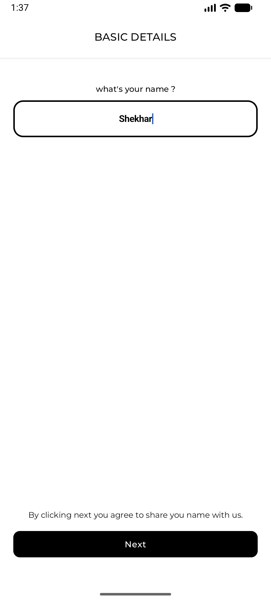
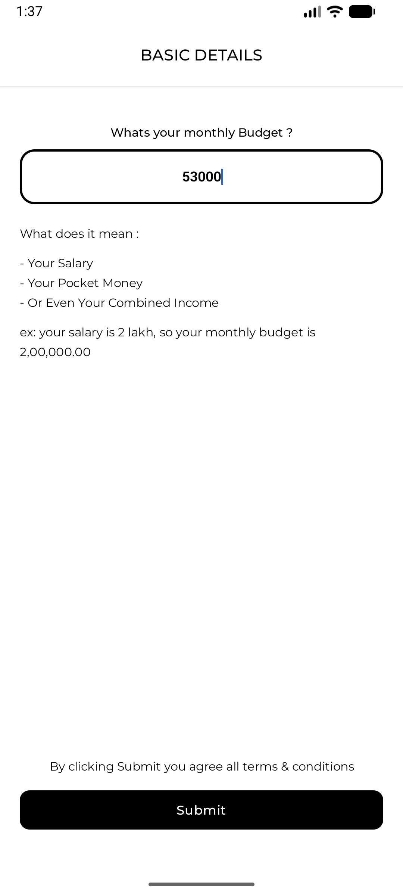
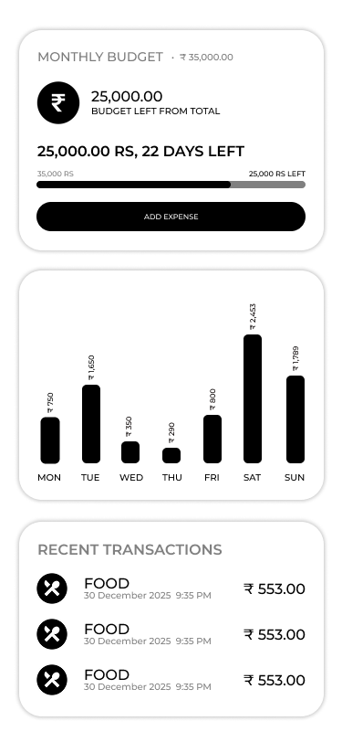
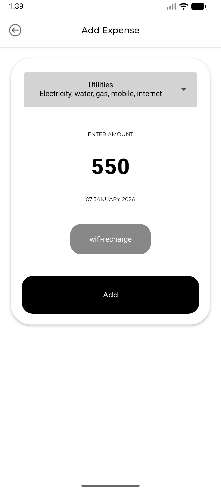
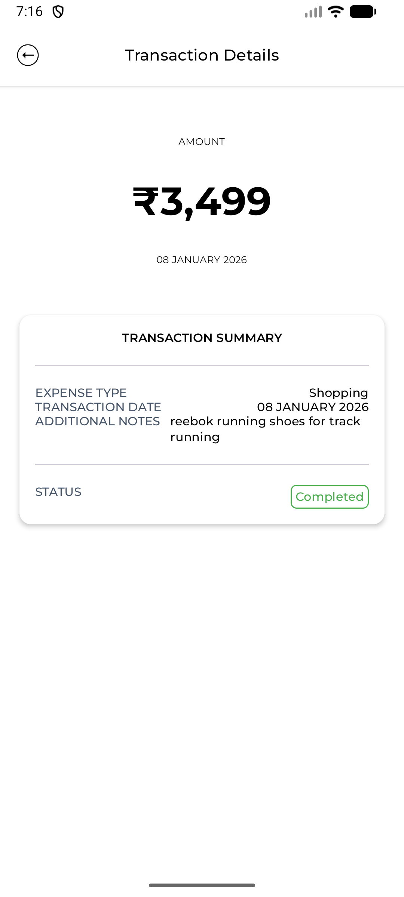
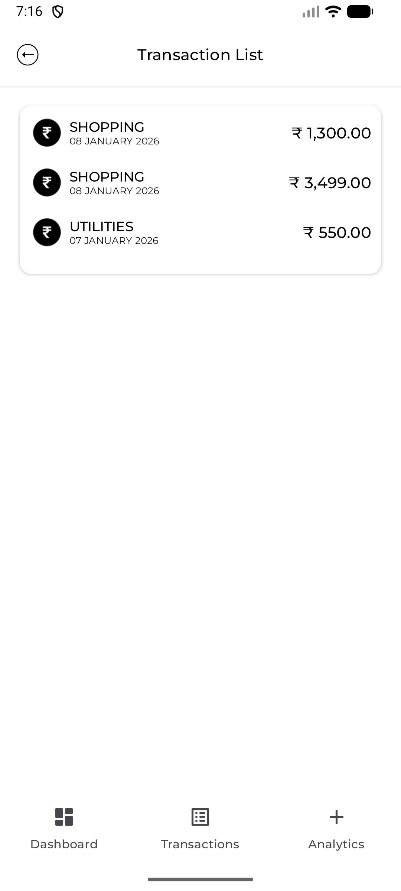

Finance Tracker (Android)

A modern Android application to track expenses, monitor spending patterns, and gain insights into personal finances through a clean and intuitive interface.

📱 Overview

Finance Tracker helps users keep track of their daily expenses and understand where their money goes. The app provides a clear overview of monthly spending, recent transactions, and visual insights through charts, making personal finance management simple and effective.

✨ Features

Professional Dashboard
Overview of total spending for the current month
Remaining balance at a glance
List of recent transactions for quick reference
Spending Analytics (Weekly View)
Graphical representation of daily spending
Helps identify spending patterns over the week
Transaction Management
Add expenses with relevant details
View a detailed screen for each individual transaction
Category-Based Expenses
Organize expenses by category for better clarity and analysis
Analytics Section (In Progress)
Advanced insights and reports are currently under development

🛠 Tech Stack

Language: Kotlin
UI: Jetpack Compose
Architecture: MVVM
Local Storage: Room Database
State Management: ViewModel, StateFlow

## 📸 Screenshots

### Onboarding

  
  

### Dashboard

  

### Add Expense & Expense Details

  
  

### Expense List

  

📦 Download & Install

You can download and install the app using the APK from GitHub Releases:
Note: Enable “Install from unknown sources” on your Android device before installing.

🚀 Run Locally

Clone the repository:
git clone git@github.com:SHEKHAR-Y/FINANCE_TRACKER.git

Open the project in Android Studio
Sync Gradle
Run the app on an emulator or physical device

📌 Project Status

This project is actively being developed.
Upcoming improvements include:
Enhanced analytics and insights
UI/UX refinements
Performance optimizations

📄 License

This project is licensed under the MIT License.

